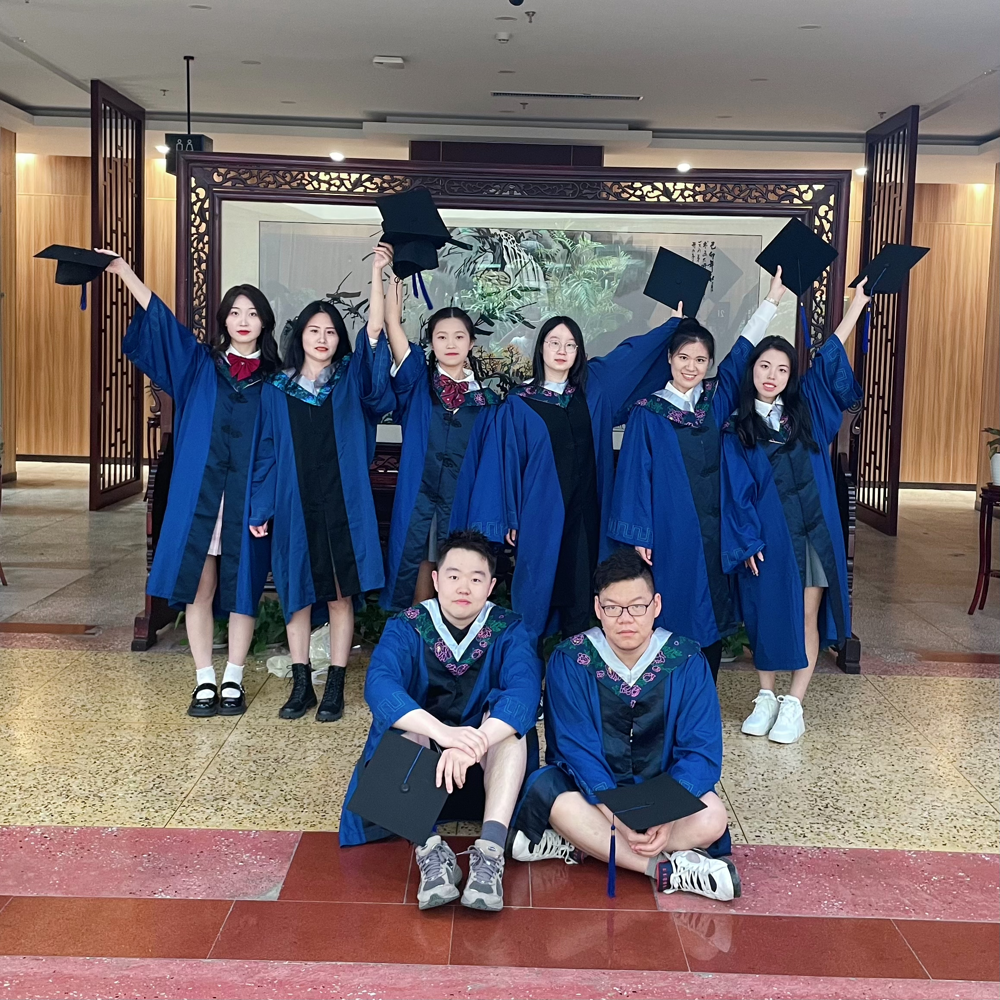
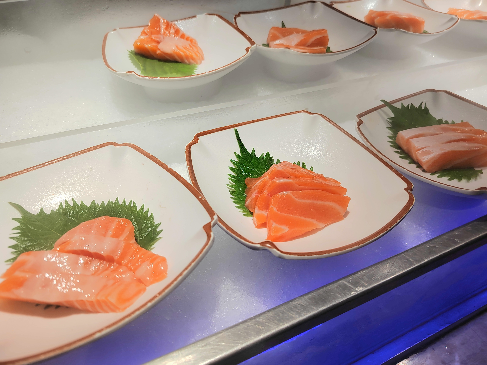
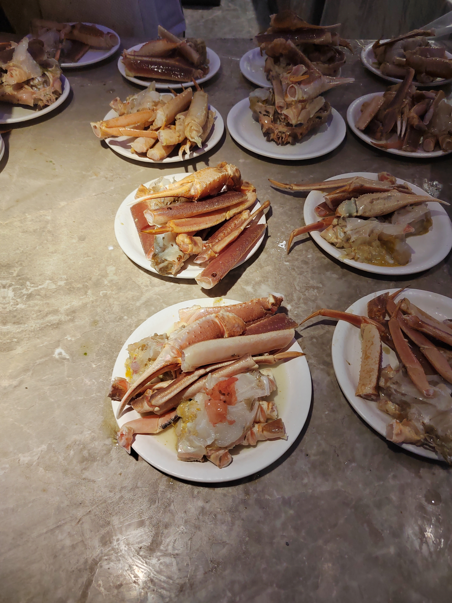
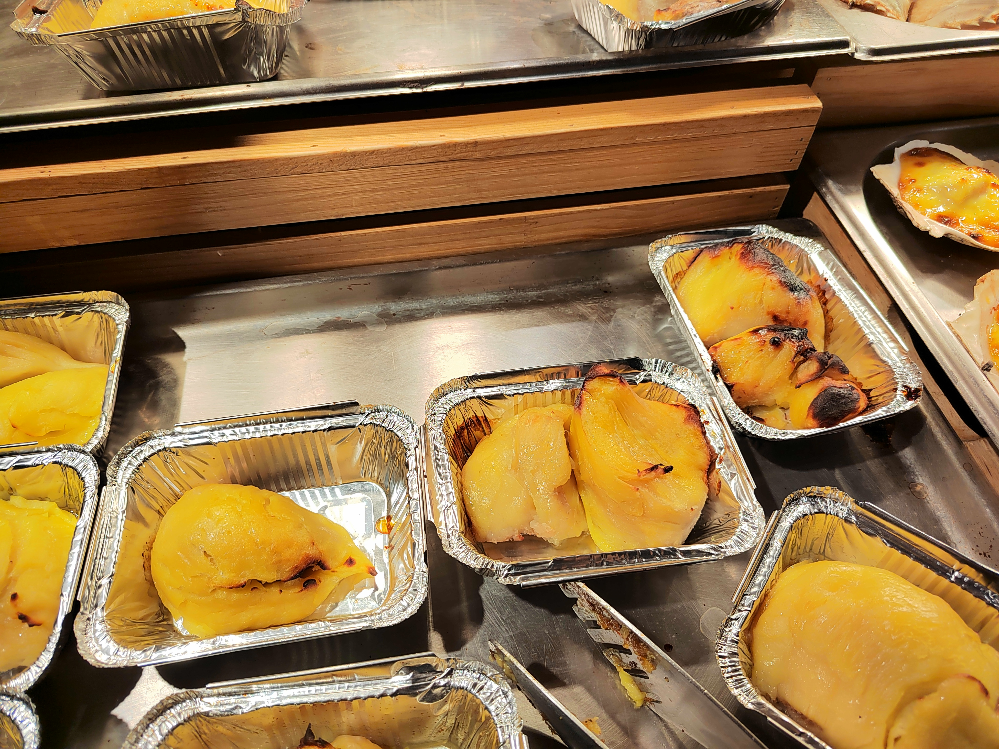
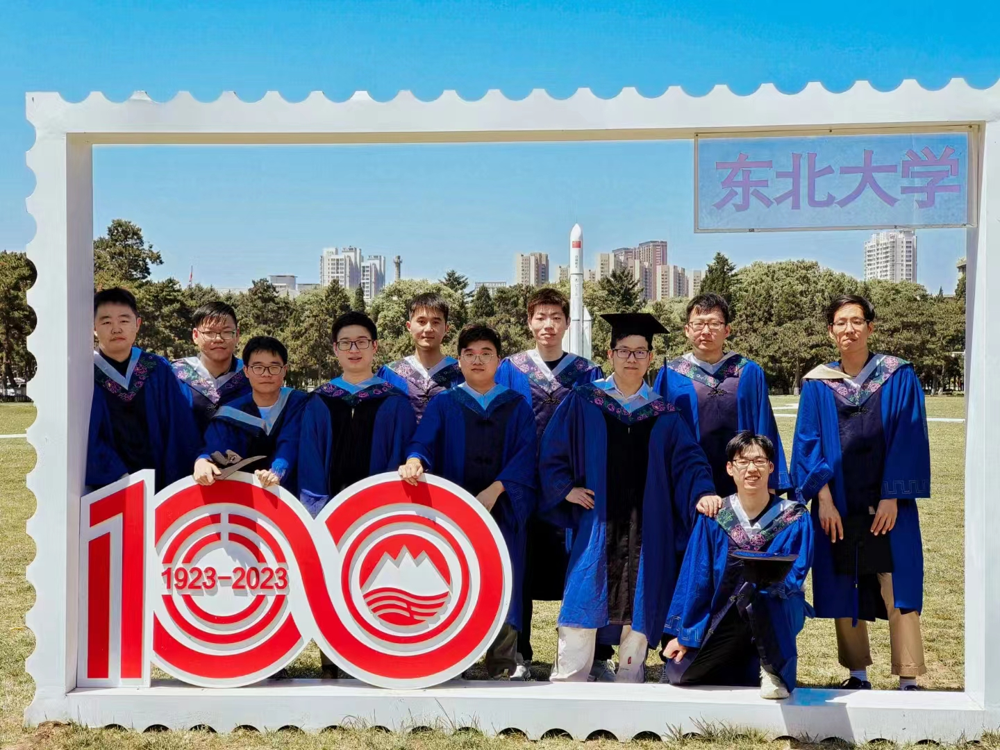

# 僵尸的日子

今早刷牙的时候，看着镜子中满嘴牙膏沫的自己，突然有一种“似曾相识”的感觉，我是在刷今天的牙还是把昨天的刷牙又重复了一遍呢。哦，突然记起来，自从写完毕业论文，我好像一个“僵尸”一样每天重复地进行着人类生存所需的最基础的活动：进食，睡觉和排泄。思考只是穿插在这些的活动之中让我意识到自己存在的一项行动。僵尸片里面的僵尸的死期是被主角们或以暴力解决或以智慧解决，而我这具“僵尸”的死期大概是毕业离校那天，死因是毕业，毕业让我没有了“僵尸”下去的物质条件和合适的身份，让我不得不恢复以思考和行动为主旨，进食、睡觉和排泄为辅助的正常生活。
 

对了，这是写给十年后的自己，我想告诉十年后的冯裕祺，如果你忘记了你在这段“僵尸”日子的感受，现在的我可以跟你说，你十分享受这种“僵尸”的感觉，没有一丝羞愧只有觉得很爽。

# 三年的学业

从本科升入研究生之后，学到的第一个道理竟然是不要对任何未知的事物抱有过多的期待。从双非的本科来到了985高校，一开始甚至怀着一丝想要继续科研的想法，以为自己进可读博搞学术，退可安稳考公，没成想最后还是选择了就业这条路，真是时也命也。现在回想一下，如果当时自己没有对“985”这个名号有过多的憧憬和向往，研一的时候应该就不会那么难过了。

 

研究生的学习，如果有师门的传承，同组之间的有效的沟通和交流，是十分有效的学习方式。但是如果没有这些条件，那么恭喜你，你也是和我一样的“独行侠”了。做一个独行侠，除了有孤独，无人指引，没有经验传承和没有交流沟通这些缺点之外，但是也有足够的自由。如何高效地搜集信息，整理信息，并通过搜集整理到的信息做出自己的判断决策，我认为这是研究生三年最应该学习和锻炼的能力，我们生活在一个信息爆炸的时代，获取信息的渠道和方式与之前的时代相比已经发生了翻天覆地的变化，信息的流通变得非常简单高效，如何利用自己有限的注意力来获取有用的信息变得无比的重要。

 

十年后的我，希望你能继续保持对信息的敏感和搜集汇总信息的能力。

# 在东北大学的生活

来东北大学上学之前，对我妈一直在说，东北宿舍的暖气很足，根本不需要做这么厚的被子，没想到研一的第一个冬天就给我狠狠地上了一课。每当我在夏天热的满头大汗的时候，一想到冬天的东北大学宿舍就能立刻从满头大汗的物理状态，到心冷的瑟瑟发抖。谢谢你，东北大学，谢谢你让我体验到了冬天室内只有10℃的宿舍（辽宁供暖条例规定冬季室内供暖温度不得低于18℃）。谢谢你，东北大学，让我体验了当皮球的感觉，宿管联系后勤，后勤联系供暖公司，供暖公司上门测温之后来一句线路问题没法解决。我想，如果宿舍冬天能保证温暖，也许对东北大学的感情就能再深一点，可惜，在这种向上负责框架下面，宿舍暖不暖这个问题除了住在这个宿舍里面的人之外，对于其他人而言就是一个坐在屋子里的大象，只要不去承认这个大象的存在，那就可以在屋子里面安坐，至于被大象压倒的人，无人关心。

吃在东北大学，呃，这个问题我又不得不抱怨一下云南大学了。大三下学期参加云南大学夏令营，在云南大学的食堂吃饭给了我一种，只要学校的等级越高，985>211>双非，那么这个学校的食堂也就越便宜越好吃。来到东北大学，三年三涨的饭菜，猪肉涨价我涨价，猪肉跌价我不动，再加上一吃一食堂必肚子疼的感受，让我对校内的吃是没有一点美好的回忆。还好，在研三下即将毕业的时候，口罩问题（不知道十年后的我看到这个口罩问题是否能想起这段特殊的时光）也总算退出了这个版本。校外的美食还是很多的，并且很多性价比很高，同样质量的菜，如果在孝义的话感觉要贵出20%~30%。

 

每当想到人际关系这个问题，就让人头大。三年来，人与人之间快乐的事情好像总被时间冲淡，但是让人难过的事情却随着时间加深了记忆。当三年前踏入宿舍门的那一刻就想到了今日的离别，只不过没有想到离别是那么的快，快的让我分不清是自己的记忆力太好还是本来发生的事情就不多。三年（严格来说是两年）在宿舍和舍友的畅聊，同学打羽毛球，打篮球的快乐时光过的好快。时间要是能像照片一样，用瞬间定格一个时刻，再把这些个快乐的时刻做成一个个糖果，放进糖果罐子里面，之后遇到困苦的时候就能躲到这个罐子里面，逃避让人难受的现实问题。当然，一味的沉湎在过去的快乐是对未来的不确定和恐惧，十年后的自己，不知道那时的你是否更加坚定更有勇气去面对未知和挑战。

 

三年以来，我一直想要自己变得更加的乐观，我一直对一个未知的事物总以消极的角度去看。不知道为什么，我自己的贝叶斯先验自动加上了悲观属性，对一个成功与否的事，首先会去想如果失败了怎么样，这样魔怔的我，甚至会在对待感情的时候也自动加入悲观的先验，对喜欢的人，在采取了行动之后，如果对方也给我回应，我只会去想什么两个人不合适，如果分手了怎么怎么样，真是有病，真是无语。十年后的我，如果你还是这么负面，还是这么有病，我想那时候你怕是还是孓然一身吧，你要还是这么有病的话，你应该不会和现在的我一样，送别了你喜欢的人然后像个傻逼一样哭吧，希望十年后的我不要有送别也不要再像个傻逼一样哭吧。

# 结束

三年的总结大致如上，每次需要这种长时间的长文输出就后悔自己在语文课上的深度睡眠，但是自己又在想，当初语文课不睡的话那么就要把这个睡眠时间在数学课？物理课？又或者是化学课上补回来，想了想又觉得不划算，那就一块钱掰成几瓣花，弱化了语文能力，苦了读者，娱乐自己。

 

未来的自己，希望再看到这里，我是对过去美好的释怀，而不是酸溜溜的回忆，笑总比哭好。

 

PS:写完之后发现自己立的Flag太高了，十年之后的我是怎样的不知道，但是光网站域名十年的租金就是肉眼可见的高。也好，为了不辜负这网站租金，倒逼自己不断更新吧。

