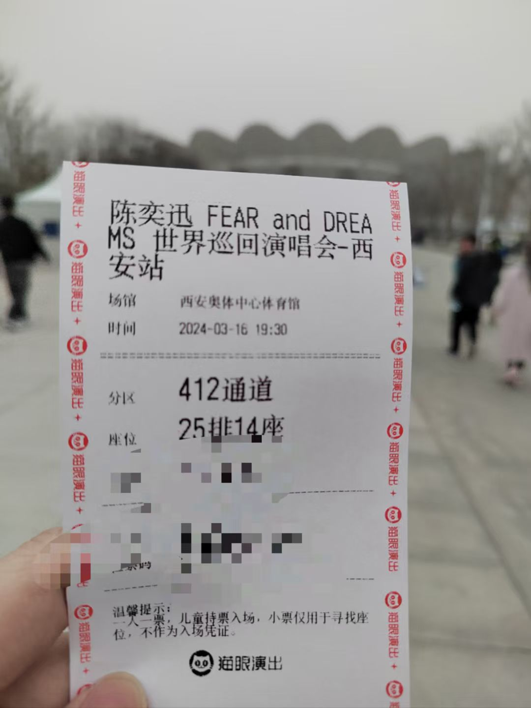
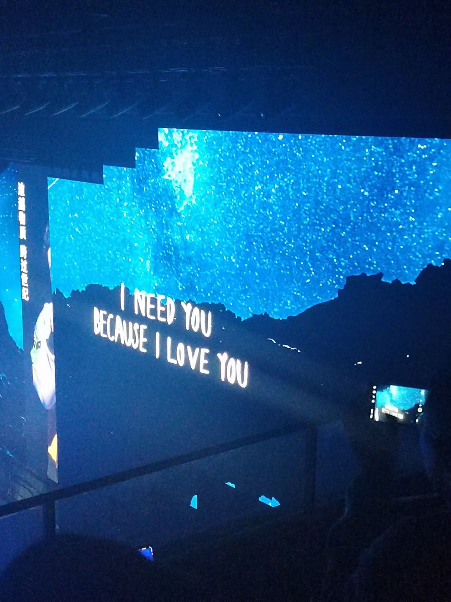
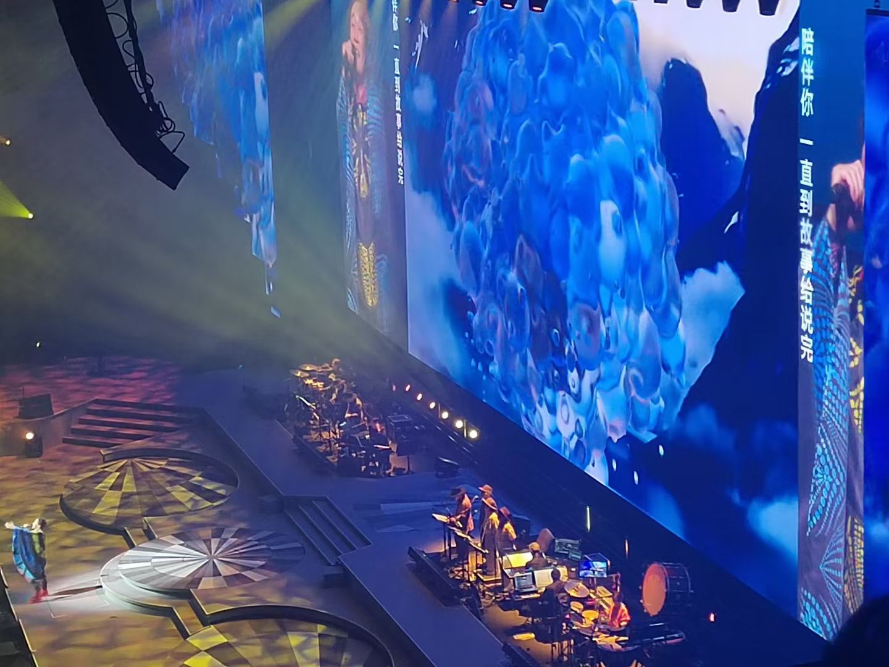

# Fear and Dreams

桂林阴雨多，晴天少。尤其是在冬季，本就缺乏取暖设施的桂林，太阳的出现就总会让人更加珍惜。大一大二的时候，最喜欢在图书馆靠着太阳的地方，要么写着学不懂的数分作业，要么看着意义不明的小说，但是耳机里播放的基本都是《陪你度过漫长岁月》。
    在现场听到之后，思绪又被强行拉回过去，但是记忆最好的形态就是记忆，不可一味的缅怀。希望自己能找到当时在图书馆里漫无目的，但又对知识的纯粹，支撑自己一直走下去。
    
    

    

